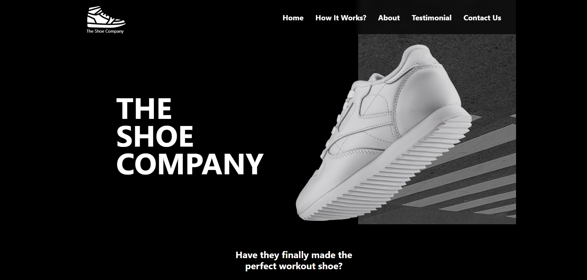

# 👟 Shoe Webpage - Tailwind CSS

A beautiful and responsive **Shoe Landing Page** built using **Tailwind CSS**.  
This project is designed to showcase an elegant front-end design using Tailwind utility classes and modern development practices.

---

## Screenshot



## 🚀 Features

- 🪶 **Tailwind CSS Utility Classes** — Fast, consistent styling without writing custom CSS.  
- 📱 **Fully Responsive** — Works perfectly on mobile, tablet, and desktop.  
- 🎨 **Modern UI** — Clean layout with stylish typography and hover effects.  
- ⚡ **Optimized Performance** — Lightweight and fast-loading webpage.  
- 🧩 **Easy to Customize** — Simple folder structure and reusable components.

---

## 🧱 Technologies Used

| Technology | Description |
|-------------|-------------|
| **HTML5** | Page structure |
| **Tailwind CSS** | Styling and layout |
| **Node.js & npm** | For managing dependencies |
| **PostCSS** | To compile Tailwind CSS into standard CSS |
---


```js
## 📁 Folder Structure

shoe-webpage-tailwindcss/
│
├── node_modules/ # Installed dependencies (auto-generated)
├── src/
│ ├── assets/ # Images, icons, and other media files
│ ├── css/
│ │ ├── style.css # Main input CSS file (with Tailwind directives)
│ │ └── output.css # Compiled Tailwind CSS file
│ └── index.html # Main webpage file
│
├── .gitignore
├── package.json # Node.js dependencies and scripts
├── package-lock.json # Auto-generated lock file
└── README.md # Documentation
---
```

## ⚙️ Installation and Setup

Follow these steps to run the project locally:

### 1️⃣ Clone the Repository
```js
git clone https://github.com/your-username/shoe-webpage-tailwindcss.git
cd shoe-webpage-tailwindcss
```

### 2️⃣ Install Dependencies

Make sure you have Node.js and npm installed.
Then, install the project dependencies:
```js
npm install
```

### 3️⃣ Build Tailwind CSS

Run the Tailwind build process to compile style.css → output.css:
```js
npx tailwindcss -i ./src/css/style.css -o ./src/css/output.css --watch
```
This command watches for any changes and automatically rebuilds your CSS.

### 4️⃣ Open the Project

Open the index.html file in your browser:
```js
src/index.html
```